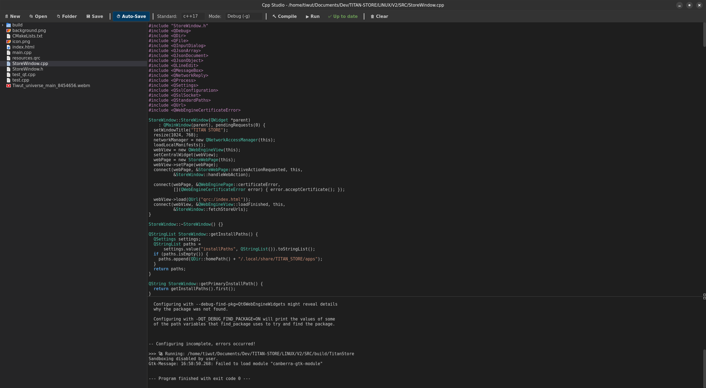

# Cpp Studio for Linux

**Cpp Studio** is a lightweight, native C++ IDE for Linux built entirely with **Qt6** and **C++**. 

Designed to mimic the sleek, modern aesthetic of Visual Studio Code, Cpp Studio provides a seamless C++ development environment with **zero terminal interaction required**. It features a smart build system that automatically detects whether you are working on a single script or a massive CMake project.

 <!-- Replace with a real screenshot of your app later -->

---

## Features

### Modern VS Code-like UI
* Sleek, flat dark theme utilizing native system window elements.
* Split-pane layout with a resizable File Explorer, Code Editor, and Console Output.
* Syntax highlighting customized for modern C++.

### Smart Build System
* **Single File Mode:** Instantly compiles standalone `.cpp` files using `g++`.
* **CMake Mode:** Automatically detects `CMakeLists.txt` in your workspace. Runs `cmake` and `cmake --build` automatically, finds the output executable, and runs it!
* Select your preferred **C++ Standard** (`c++11` to `c++23`) directly from the toolbar.
* Switch effortlessly between **Debug (-g)** and **Release (-O3)** modes.

### Fully Featured File Explorer
* Built-in file manager sidebar.
* **Right-Click Context Menu:** Create files/folders, Rename, Delete, Copy, Cut, and Paste effortlessly.

### Quality of Life
* **Auto-Save:** Automatically saves your work 1 second after you stop typing.
* **Smart Status Indicator:** Visual cues (`⚠️ Needs Compile` / `✅ Up to date`) track whether your latest code changes have been built.
* **Integrated Console:** Real-time stream of `stdout` and `stderr` directly into the bottom panel.

---

## Prerequisites

To build and run Cpp Studio, you will need the GCC compiler, CMake, and the Qt6 framework.

**For Ubuntu / Debian / Linux Mint:**
```bash
sudo apt update
sudo apt install build-essential cmake qt6-base-dev
```

**For Arch Linux:**
```bash
sudo pacman -S base-devel cmake qt6-base
```

**For Fedora:**
```bash
sudo dnf install gcc-c++ cmake qt6-qtbase-devel
```

---

## Build & Installation

Building the IDE from source is incredibly fast and only takes a few seconds.

1. Clone the repository:
```bash
git clone https://github.com/tiwut/CPP-Studio.git
cd CppStudio
```

2. Create a build directory and configure CMake:
```bash
mkdir build
cd build
cmake ..
```

3. Compile the application:
```bash
make
```

4. Run the IDE!
```bash
./CppStudio
```

---

## Keyboard Shortcuts

Cpp Studio uses standard IDE keyboard shortcuts to keep your workflow fast and familiar:

| Shortcut | Action |
| :--- | :--- |
| `Ctrl + N` | Create a New File |
| `Ctrl + O` | Open a File |
| `Ctrl + Shift + O` | Open a Workspace Folder |
| `Ctrl + S` | Save Current File |
| `Ctrl + Shift + B` | 🔨 Compile / Build Project |
| `F5` | ▶ Run Executable |

---

## How to Use

### Compiling a Single File
1. Click ** Folder** to open a workspace.
2. Hit `Ctrl + N` to create a new file (e.g., `main.cpp`).
3. Write your C++ code.
4. Press `Ctrl + Shift + B` to compile, then `F5` to run. 

### Compiling a Qt/CMake Project
1. Click ** Folder** and select the root directory of your project (the folder containing `CMakeLists.txt`).
2. Open any `.cpp` file in the project.
3. Click ** Compile**. Cpp Studio will automatically generate a `/build` folder, run CMake, and compile your entire project.
4. Watch the real-time build logs in the console panel.
5. Click **▶ Run** to launch your application.

---

## Contributing
Contributions, issues, and feature requests are welcome! 
Feel free to check out the [issues page](https://github.com/tiwut/CPP-Studio/issues).

## License
This project is licensed under the [GPL v3 License](LICENSE).
